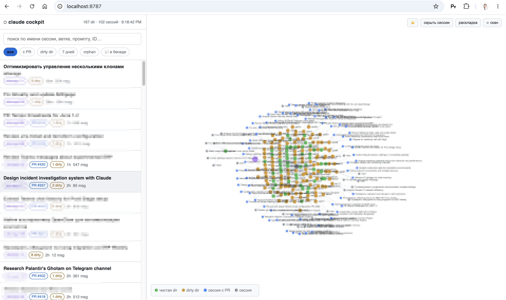

# claudecock

Локальный веб-кокпит для твоих сессий [Claude Code](https://claude.com/claude-code).



---

## 🇷🇺 Русский

Claude Code хранит каждую сессию как транскрипт в `~/.claude/projects/`. Когда их
становятся десятки в разных репозиториях и worktree'ах, простые вопросы перестают
быть простыми: *что это была за сессия, где она запускалась, открыла ли PR и о чём
вообще шла речь?* `claudecock` читает эти транскрипты (только на чтение) и даёт одну
страницу, чтобы их **видеть** и **искать**.

### Возможности

- **Граф** — `~/.claude сессии → корень-workspace → git-репозиторий → сессии`,
  на [cytoscape](https://js.cytoscape.org/) (вендорен, работает оффлайн). Цвет
  узлов = состояние: чистый репо, dirty-репо, сессия с PR.
- **Два режима поиска** в одной строке:
  - *по метаданным* — мгновенный фильтр на клиенте по имени сессии, ветке, первому
    промпту и id;
  - *💬 в беседе* — полнотекстовый поиск по всему транскрипту каждой сессии,
    ранжирование по числу совпадений, подсветка сниппетов.
- **Действия по сессии** — скопировать путь репо, скопировать session id,
  скопировать готовую команду `cd … && claude --resume <id>`, открыть репо в Finder
  или Terminal.
- **Фильтры** — с PR, в dirty-репо, последние 7 дней, orphan (транскрипт, у которого
  рабочая копия исчезла).
- **Светлая / тёмная тема**, запоминается между запусками.

Всё считается живьём из git и локальных транскриптов. Никуда ничего не отправляется
— сервер слушает только `127.0.0.1`.

### Требования

- Python 3.8+ (только стандартная библиотека — **ноль зависимостей**)
- git
- macOS для кнопок «Finder» / «Terminal» (вызывают `open` и `osascript`); остальное
  кроссплатформенно.

### Запуск

```bash
python3 serve.py            # откроет http://127.0.0.1:8787/ в браузере
python3 serve.py --port 9000 --no-open
```

Первая загрузка модели сканирует репозитории через git (несколько секунд), результат
кэшируется. Кнопка **⟳ скан** в UI пересобирает.

Можно получить сырую модель без сервера:

```bash
python3 scan.py --stats     # быстрые счётчики
python3 scan.py             # полный JSON в stdout
```

### Поиск из CLI (без браузера)

Если в браузер ходить неудобно — те же два режима поиска доступны прямо из
терминала через `search.py`:

```bash
python3 search.py "deploy nginx"     # полнотекстовый по всем транскриптам
python3 search.py -t "odoo"          # только по заголовкам/метаданным (мгновенно)
```

- **Полнотекст** читает беседу каждой сессии, ранжирует по числу совпадений и
  показывает подсвеченные сниппеты — то же, что `💬 в беседе` в UI.
- **`-t` / `--titles`** фильтрует метаданные (имя сессии, первый промпт, ветку,
  workspace, id) без чтения транскриптов, поэтому мгновенно — то же, что фильтр
  *по метаданным* в UI.

Каждый результат печатает готовую команду `cd … && claude --resume <id>`. Флаги:
`-n` лимит, `-s` число сниппетов, `--json` для скриптов, `--no-color`.

В отличие от веб-кокпита, CLI не сканирует git-рабочие копии (ahead/behind,
dirty, merged — десятки секунд `git`-вызовов), потому что поиску они не нужны.
Поэтому запуск занимает доли секунды: ~0.7 с по заголовкам, ~1 с полнотекст на
сотне сессий.

### Как устроено

`scan.py` джойнит два локальных источника:

1. **Сессии** — все `*.jsonl` под `~/.claude/projects/*`. Из транскрипта берутся
   session id, сгенерённое имя (`ai-title`), ветка и `cwd` запуска, ссылка на PR,
   число сообщений и время последней активности. Текст беседы — конкатенация только
   user/assistant сообщений (вывод инструментов игнорируется).
2. **Директории** — git-репозитории, где сессии запускались (из `cwd`), плюс их
   соседи под тем же родителем. Для каждого: ветка, dirty-счётчик, ahead/behind
   `main`, merged-в-`main`, последний коммит. Проекты не захардкожены — новые репо
   появляются сами.

`serve.py` — это `http.server` из стандартной библиотеки: кэширует модель в памяти,
отдаёт одностраничный UI, выполняет полнотекстовый поиск (`/api/search`) и две узкие
локальные операции (`/api/open`, `/api/terminal`), ограниченные директориями, которые
кокпит реально проиндексировал.

### Конфигурация

| Env-переменная | По умолчанию | Смысл |
|---|---|---|
| `CLAUDECOCK_ROOTS` | *(нет)* | Доп. workspace-корни для поиска соседних git-репо, разделитель `os.pathsep`. Обычно корни определяются из того, где запускались сессии. |
| `CLAUDECOCK_MAIN_BRANCH` | `main` | Ветка для проверок ahead/behind и merged. |

### Ограничения

- **`merged` считается против *локального* `main`**, который в одноразовых
  клонах/worktree'ах часто протухший, поэтому сейчас недооценивает. Надёжный сигнал
  «можно сносить» требует состояния PR/remote (например, через `gh`) — это следующий
  шаг.
- Действия Finder/Terminal — только macOS.

---

## 🇬🇧 English

Claude Code stores every session as a transcript under `~/.claude/projects/`. Once
you have dozens of them across many repos and worktrees, simple questions get hard:
*which session was that, where did it run, did it open a PR, and what did we actually
talk about?* `claudecock` reads those transcripts (read-only) and gives you a single
page to **see** and **search** them.

### Features

- **Graph view** — `~/.claude sessions → workspace root → git repo → sessions`,
  rendered with [cytoscape](https://js.cytoscape.org/) (vendored, works offline).
  Nodes are colored by state: clean repo, dirty repo, session with a PR.
- **Two search modes** over one box:
  - *metadata* — instant client-side filter over session title, branch, first
    prompt, and id;
  - *💬 in-conversation* — full-text search across the entire transcript of every
    session, ranked by hit count, with highlighted snippets.
- **Per-session actions** — copy the repo path, copy the session id, copy a ready
  `cd … && claude --resume <id>` command, reveal the repo in Finder, or open a
  Terminal there.
- **Filters** — sessions with a PR, sessions in a dirty repo, last 7 days, orphans
  (transcript whose working copy is gone).
- **Light / dark theme**, remembered across runs.

Everything is derived live from git and your local transcripts. Nothing is sent
anywhere — the server binds to `127.0.0.1` only.

### Requirements

- Python 3.8+ (standard library only — **zero dependencies**)
- git
- macOS for the "Finder" / "Terminal" buttons (they shell out to `open` and
  `osascript`); everything else is cross-platform.

### Run

```bash
python3 serve.py            # opens http://127.0.0.1:8787/ in your browser
python3 serve.py --port 9000 --no-open
```

The first model load scans your repos with git and may take a few seconds; the
result is cached. Hit **⟳ refresh** in the UI to rebuild.

You can also dump the raw model without the server:

```bash
python3 scan.py --stats     # quick counts
python3 scan.py             # full JSON model to stdout
```

### CLI search (no browser)

If going to the browser is awkward, the same two search modes are available
straight from the terminal via `search.py`:

```bash
python3 search.py "deploy nginx"     # full-text across every transcript
python3 search.py -t "odoo"          # by title/metadata only (instant)
```

- **Full-text** reads each session's conversation, ranks by hit count, and shows
  highlighted snippets — same as `💬 in-conversation` in the UI.
- **`-t` / `--titles`** filters metadata (session title, first prompt, branch,
  workspace, id) without reading transcripts, so it is instant — same as the
  *metadata* filter in the UI.

Each result prints a ready `cd … && claude --resume <id>` command. Flags: `-n`
limit, `-s` snippet count, `--json` for scripts, `--no-color`.

Unlike the web cockpit, the CLI does **not** scan git working copies (ahead/
behind, dirty, merged — tens of seconds of `git` calls), since search doesn't
need them. Startup is therefore sub-second: ~0.7s for titles, ~1s for full-text
across a hundred sessions.

### How it works

`scan.py` joins two local sources:

1. **Sessions** — every `*.jsonl` under `~/.claude/projects/*`. From each transcript
   it pulls the session id, the AI-generated title (`ai-title`), the git branch and
   `cwd` it ran in, any PR link, the message count, and the last activity time. The
   conversation text is the concatenation of user/assistant message text only (tool
   output is ignored).
2. **Directories** — the git repos those sessions ran in (derived from each session's
   `cwd`) plus their sibling repos under the same parent. For each it records branch,
   dirty count, ahead/behind `main`, merged-into-`main`, and the last commit. No
   project is hardcoded; new repos appear automatically.

`serve.py` is a stdlib `http.server` that caches the model in memory, serves the
single-page UI, runs the full-text search (`/api/search`), and exposes two narrow
local actions (`/api/open`, `/api/terminal`) restricted to directories the cockpit
actually indexed.

### Configuration

| Env var | Default | Meaning |
|---|---|---|
| `CLAUDECOCK_ROOTS` | *(none)* | Extra workspace roots to also scan for sibling git repos, `os.pathsep`-separated. Roots are normally discovered from where sessions ran. |
| `CLAUDECOCK_MAIN_BRANCH` | `main` | Branch used for the ahead/behind and merged checks. |

### Limitations

- **`merged` is computed against the *local* `main`**, which is often stale in
  throwaway clones/worktrees, so it currently under-reports. A reliable "safe to
  delete" signal needs the PR/remote state (e.g. via `gh`) — that's the next step.
- Finder/Terminal actions are macOS-only.

---

## License

MIT — see [LICENSE](LICENSE).
